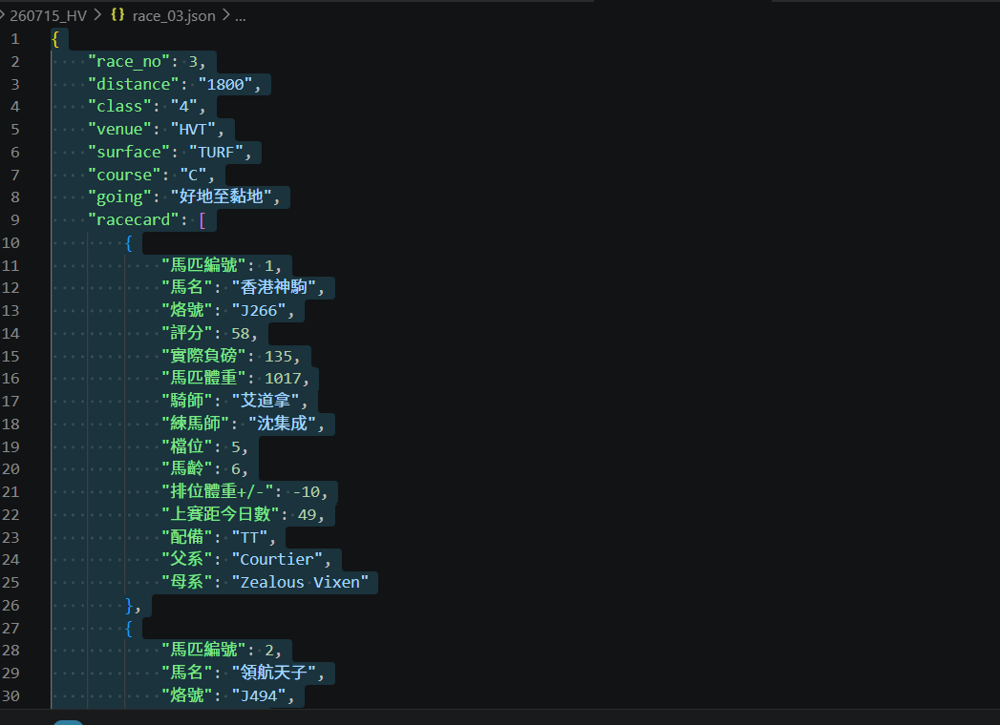
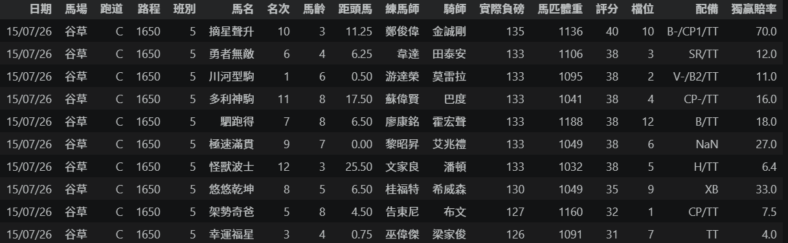

# Resilient Data Collection & ETL Pipeline

A Python-based data pipeline designed to collect, transform, and structure data from dynamic web sources into analysis-ready datasets.

This project demonstrates practical experience in web automation, data extraction, ETL workflows, and building reliable data collection systems.

---

## Project Overview

Many websites contain valuable information that is difficult to collect manually due to dynamic content loading and complex page structures.

This project was developed to automate the process of collecting structured data from dynamic websites and transforming raw information into clean datasets for analysis, reporting, and downstream applications.

Key objectives:

* Automate repetitive data collection workflows
* Extract structured information from dynamic websites
* Transform raw data into analysis-ready formats
* Build reusable and reliable ETL workflows

---

## Pipeline Architecture

---

## Key Features

### Dynamic Data Collection

Developed automated collection workflows for JavaScript-rendered websites using Python-based automation and data extraction techniques.

### Data Processing & Transformation

Cleaned, normalized, and transformed raw extracted information into structured pandas DataFrames.

### Reliable Automation Workflow

Implemented error handling and recovery mechanisms to improve stability during repeated data collection tasks.

### Analytics-Ready Output

Generated structured datasets suitable for reporting, analysis, and database storage.

---

## Example Output

### Structured JSON Data

### Processed Dataset

---

## Technology Stack

* Python
* Selenium
* Pandas
* Requests
* BeautifulSoup
* GraphQL
* SQLite

---

## Skills Demonstrated

* Web Scraping
* Data Extraction
* ETL Pipeline Development
* Data Cleaning
* Automation
* Python Development
* API Integration
